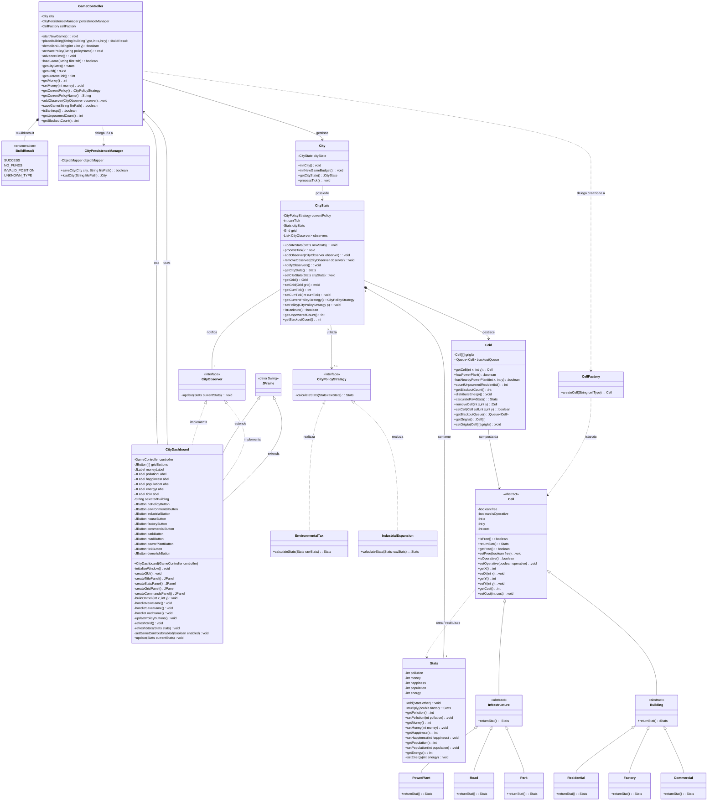

---

The system architecture has been designed to keep components separate, easy to test, and ready for future expansions, applying GRASP principles (High Cohesion, Low Coupling) and Gang of Four (GoF) design patterns.

Core Engine and Domain Model

City & CityState: City represents the city and coordinates the startup and processing of the simulation. To prevent it from becoming too complex ("God Object"), it delegates simulation state management to the CityState class.

Grid & Cell: The spatial map is managed by Grid. Instead of having separate arrays for each type of building, the grid uses the abstract Cell class. This allows the map to iterate over all buildings polymorphically by calling the generic returnStat() method without needing to know the exact building it is processing.

Stats: Encapsulates the main city metrics (Money, Population, Happiness, Pollution, and Energy), keeping the related attributes private and providing getters, setters, and operations to combine and modify the values.

Implemented Design Patterns

Model-View-Controller (GameController): The system isolates business logic from the graphical interface. The GameController handles user input (e.g., placing a building, activating a policy) and translates it into commands for the game engine, protecting City's internal state.

Factory Pattern (CellFactory): The task of instantiating physical buildings is delegated to a dedicated factory. When the Controller needs to place a building, it does not call the concrete constructor (e.g., new Park()), but asks CellFactory to return a generic Cell. This makes the code flexible: adding new buildings in the future will require modifications only to the Factory.

Observer Pattern (CityObserver): Guarantees data flow to the screen without blocking the engine. At the end of each turn, CityState (the Subject) notifies registered observers by sending the updated Stats object. This way, the engine does not depend on the specific graphical technology used (Swing, Web, etc.).

Strategy Pattern (CityPolicyStrategy): City regulations (e.g., Taxes, Industrial Expansion) alter score calculations. Instead of cluttering the engine with if/else blocks, each policy is a separate class implementing the same interface. Rules can thus be swapped transparently at runtime.

Pure Fabrication (CityPersistenceManager): To maintain High Cohesion and respect the Single Responsibility Principle (SRP), I/O logic (reading and writing JSON save files) has been completely removed from City and isolated in a dedicated manager

