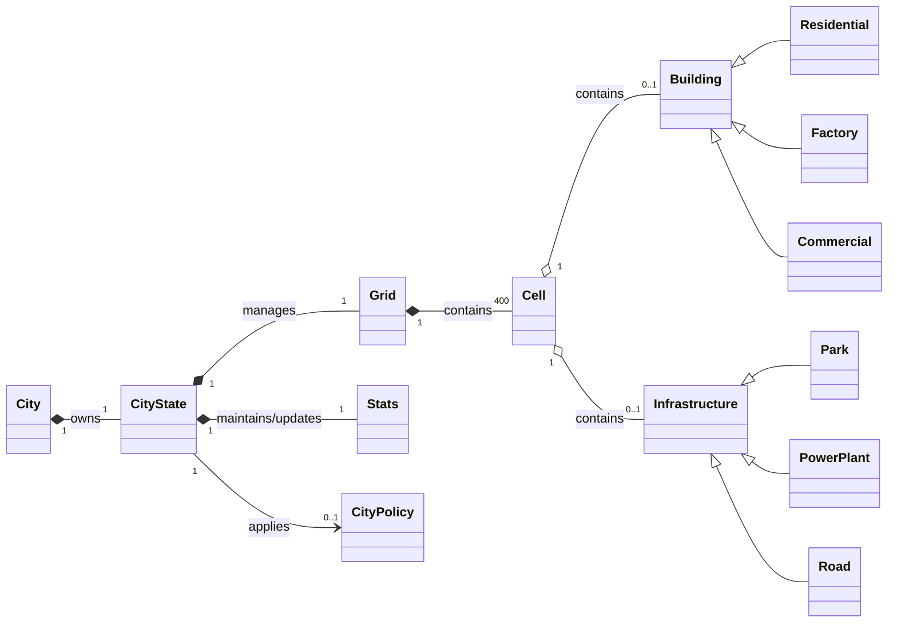

---

## Main Conceptual Entities

### City

The main entity representing the city being simulated. It is associated with the current state of the city, which describes its evolution over time and its current situation.

### CityState

Represents the dynamic state of the city during the simulation. It maintains information related to the evolution over time, the city configuration, the global metrics and the currently active policy, if any.

### Grid (Urban Map)

Represents the spatial structure of the city through a grid. It contains the cells that make up the urban territory and determines their spatial arrangement.

### Cell (Territorial Entity)

Represents a unit of the urban grid. A cell can contain a building or an infrastructure, such as **Residential, Factory, Commercial, Park, Power Plant or Road**, and contributes to the overall state of the city.

### Building

Represents the conceptual category of buildings present in the city. It includes **Residential, Factory and Commercial**, each characterized by specific effects on the city's metrics.

### Infrastructure

Represents the conceptual category of infrastructure present in the city. It includes **Park, Power Plant e Road**, which contribute differently to the city's state and metrics.

### Stats (Global Metrics)

Represents the set of metrics describing the state of the city, including **Money, Population, Happiness, Pollution and Energy**. Their values depend on the elements present in the city and on the rules or policies applied to the simulation.

### CityPolicy

Represents a policy that can be activated by the City Mayor to modify how certain city metrics are calculated. Available policies include, for example, **Environmental Tax** and **Industrial Expansion**.

## Key Domain Relationships

### City (1) ---- owns ----> (1) CityState

Each city owns a single current state representing the situation of the city during the simulation.

### CityState (1) ---- manages ----> (1) Grid

The city state is associated with a grid representing the spatial arrangement of buildings and infrastructures.

### Grid (1) ---- contains ----> (400) Cell

The grid consists of 400 cells representing the available positions in the urban territory. The city uses a 20×20 grid.

### Cell ---- Building

A cell can contain at most one building. Buildings include **Residential, Factory and Commercial**, each characterized by specific effects on the city's metrics.

### Cell ---- Infrastructure

A cell can contain at most one infrastructure. Infrastructures include **Park, Power Plant and Road**, which contribute differently to the city's state and metrics.

### CityState (1) ---- maintains/updates ----> (1) Stats

The city state maintains the global metrics describing the current situation of the city.

### CityState (1) ---- applies ----> (0..1) CityPolicy

A city can have zero or one active policy. When present, the policy influences the calculation of the metrics according to its own rules.
