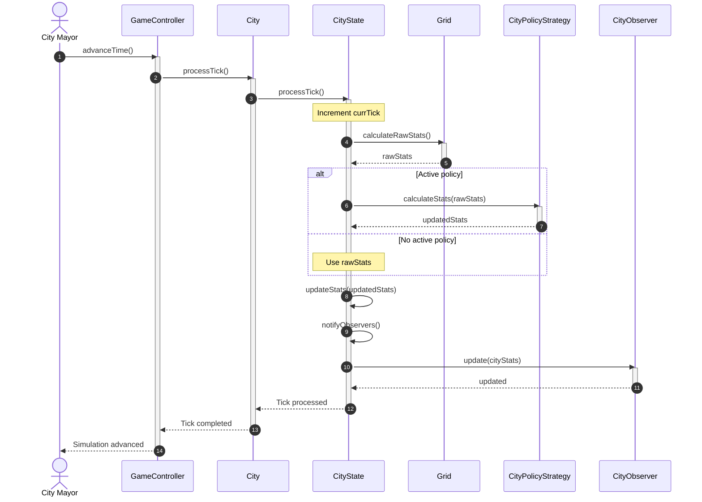

```mermaid
sequenceDiagram
    autonumber
    actor Mayor as City Mayor
    participant GC as GameController
    participant City as City
    participant CS as CityState
    participant Grid as Grid
    participant Policy as CityPolicyStrategy
    participant Obs as CityObserver

    Mayor->>GC: advanceTime()
    activate GC

    GC->>City: processTick()
    activate City

    City->>CS: processTick()
    activate CS

    Note over CS: Increment currTick

    CS->>Grid: calculateRawStats()
    activate Grid
    Grid-->>CS: rawStats
    deactivate Grid

    alt Active policy
        CS->>Policy: calculateStats(rawStats)
        activate Policy
        Policy-->>CS: updatedStats
        deactivate Policy
    else No active policy
        Note over CS: Use rawStats
    end

    CS->>CS: updateStats(updatedStats)
    CS->>CS: notifyObservers()

    CS->>Obs: update(cityStats)
    activate Obs
    Obs-->>CS: updated
    deactivate Obs

    CS-->>City: Tick processed
    deactivate CS

    City-->>GC: Tick completed
    deactivate City

    GC-->>Mayor: Simulation advanced
    deactivate GC
```
