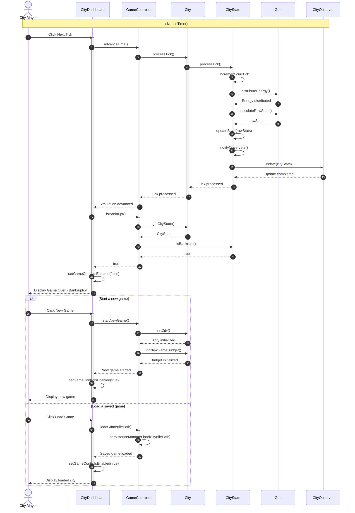

```mermaid
sequenceDiagram
    autonumber
    actor Mayor as City Mayor
    participant Dashboard as CityDashboard
    participant Controller as GameController
    participant City as City
    participant State as CityState
    participant Grid as Grid
    participant Observer as CityObserver

    Note over Mayor,Observer: advanceTime()

    Mayor->>Dashboard: Click Next Tick
    activate Dashboard

    Dashboard->>Controller: advanceTime()
    activate Controller

    Controller->>City: processTick()
    activate City

    City->>State: processTick()
    activate State

    State->>State: Increment currTick
    State->>Grid: distributeEnergy()
    Grid-->>State: Energy distributed
    State->>Grid: calculateRawStats()
    Grid-->>State: rawStats
    State->>State: updateStats(rawStats)
    State->>State: notifyObservers()

    State->>Observer: update(cityStats)
    Observer-->>State: Update completed

    State-->>City: Tick processed
    deactivate State
    City-->>Controller: Tick processed
    deactivate City
    Controller-->>Dashboard: Simulation advanced
    deactivate Controller

    Dashboard->>Controller: isBankrupt()
    activate Controller
    Controller->>City: getCityState()
    City-->>Controller: CityState
    Controller->>State: isBankrupt()
    State-->>Controller: true
    Controller-->>Dashboard: true
    deactivate Controller

    Dashboard->>Dashboard: setGameControlsEnabled(false)
    Dashboard-->>Mayor: Display Game Over - Bankruptcy

    deactivate Dashboard

    alt Start a new game
        Mayor->>Dashboard: Click New Game
        activate Dashboard
        Dashboard->>Controller: startNewGame()
        activate Controller
        Controller->>City: initCity()
        City-->>Controller: City initialized
        Controller->>City: initNewGameBudget()
        City-->>Controller: Budget initialized
        Controller-->>Dashboard: New game started
        deactivate Controller
        Dashboard->>Dashboard: setGameControlsEnabled(true)
        Dashboard-->>Mayor: Display new game
        deactivate Dashboard

    else Load a saved game
        Mayor->>Dashboard: Click Load Game
        activate Dashboard
        Dashboard->>Controller: loadGame(filePath)
        activate Controller
        Controller->>Controller: persistenceManager.loadCity(filePath)
        Controller-->>Dashboard: Saved game loaded
        deactivate Controller
        Dashboard->>Dashboard: setGameControlsEnabled(true)
        Dashboard-->>Mayor: Display loaded city
        deactivate Dashboard
    end
```
