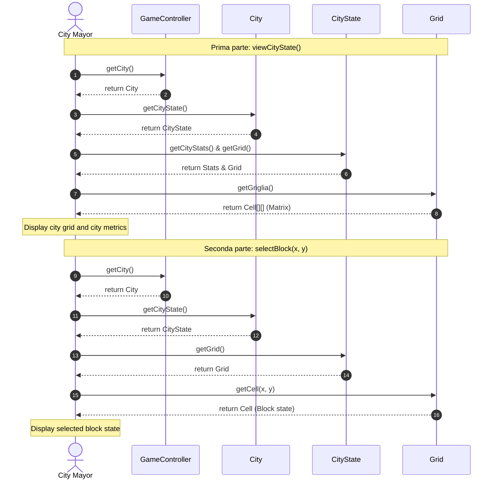

```mermaid
sequenceDiagram
    autonumber
    actor Mayor as City Mayor
    participant Controller as GameController
    participant CityObj as City
    participant State as CityState
    participant TheGrid as Grid

    Note over Mayor, TheGrid: Prima parte: viewCityState()
    Mayor->>Controller: getCity()
    Controller-->>Mayor: return City
    Mayor->>CityObj: getCityState()
    CityObj-->>Mayor: return CityState
    Mayor->>State: getCityStats() & getGrid()
    State-->>Mayor: return Stats & Grid
    Mayor->>TheGrid: getGriglia()
    TheGrid-->>Mayor: return Cell[][] (Matrix)
    Note over Mayor: Display city grid and city metrics

    Note over Mayor, TheGrid: Seconda parte: selectBlock(x, y)
    Mayor->>Controller: getCity()
    Controller-->>Mayor: return City
    Mayor->>CityObj: getCityState()
    CityObj-->>Mayor: return CityState
    Mayor->>State: getGrid()
    State-->>Mayor: return Grid
    Mayor->>TheGrid: getCell(x, y)
    TheGrid-->>Mayor: return Cell (Block state)
    Note over Mayor: Display selected block state
```
