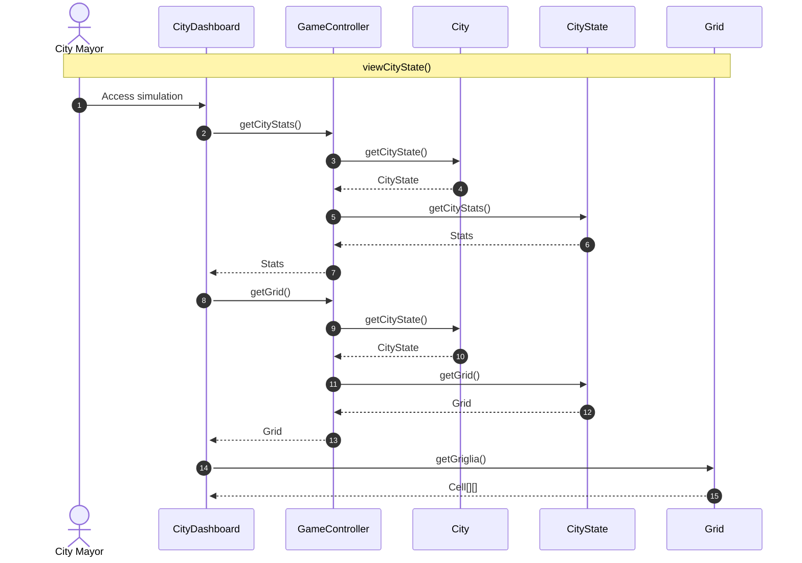

```mermaid
sequenceDiagram
    autonumber
    actor Mayor as City Mayor
    participant Dashboard as CityDashboard
    participant Controller as GameController
    participant City as City
    participant State as CityState
    participant Grid as Grid

    Note over Mayor,Grid: viewCityState()

    Mayor->>Dashboard: Access simulation
    activate Dashboard

    Dashboard->>Controller: getCityStats()
    Controller->>City: getCityState()
    City-->>Controller: CityState
    Controller->>State: getCityStats()
    State-->>Controller: Stats
    Controller-->>Dashboard: Stats

    Dashboard->>Controller: getGrid()
    Controller->>City: getCityState()
    City-->>Controller: CityState
    Controller->>State: getGrid()
    State-->>Controller: Grid
    Controller-->>Dashboard: Grid

    Dashboard->>Grid: getGriglia()
    Grid-->>Dashboard: Cell[][]

```
