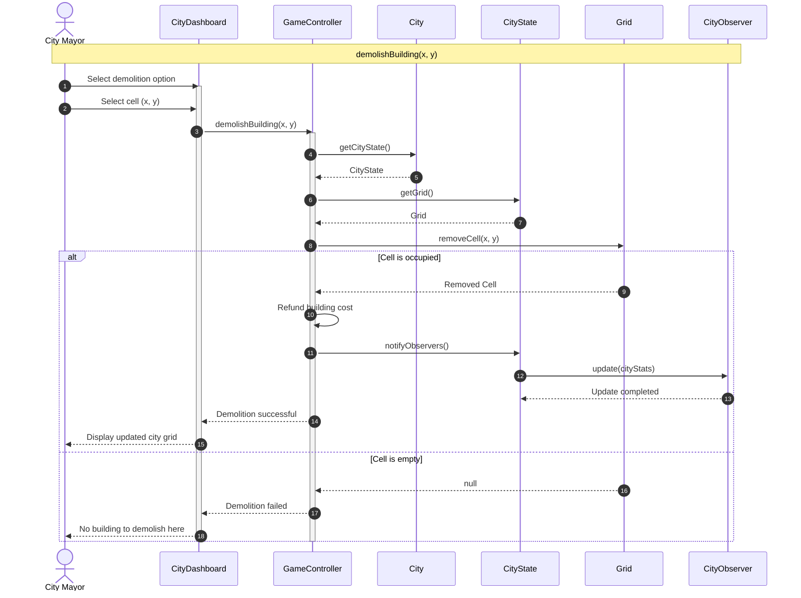

```mermaid
sequenceDiagram
    autonumber
    actor Mayor as City Mayor
    participant Dashboard as CityDashboard
    participant Controller as GameController
    participant City as City
    participant State as CityState
    participant Grid as Grid
    participant Observer as CityObserver

    Note over Mayor,Observer: demolishBuilding(x, y)

    Mayor->>Dashboard: Select demolition option
    activate Dashboard

    Mayor->>Dashboard: Select cell (x, y)
    Dashboard->>Controller: demolishBuilding(x, y)
    activate Controller

    Controller->>City: getCityState()
    City-->>Controller: CityState

    Controller->>State: getGrid()
    State-->>Controller: Grid

    Controller->>Grid: removeCell(x, y)

    alt Cell is occupied
        Grid-->>Controller: Removed Cell
        Controller->>Controller: Refund building cost
        Controller->>State: notifyObservers()
        State->>Observer: update(cityStats)
        Observer-->>State: Update completed
        Controller-->>Dashboard: Demolition successful
        Dashboard-->>Mayor: Display updated city grid

    else Cell is empty
        Grid-->>Controller: null
        Controller-->>Dashboard: Demolition failed
        Dashboard-->>Mayor: No building to demolish here
    end

    deactivate Controller
    deactivate Dashboard
```
