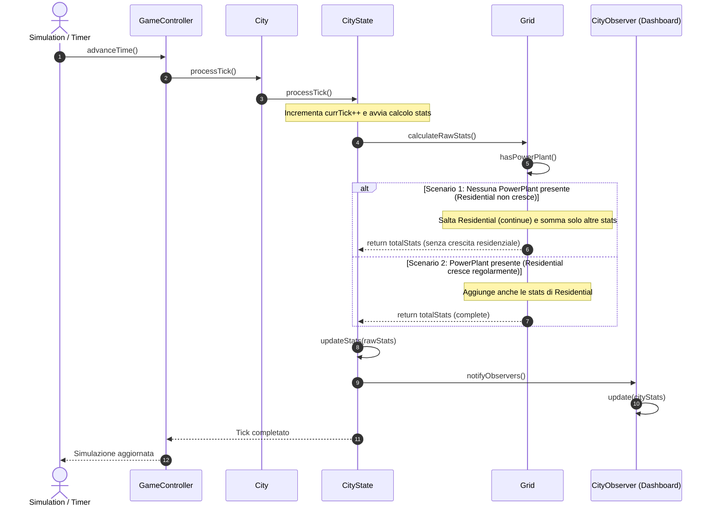

```mermaid
sequenceDiagram
    autonumber
    actor System as Simulation / Timer
    participant Controller as GameController
    participant CityObj as City
    participant State as CityState
    participant TheGrid as Grid
    participant Observer as CityObserver (Dashboard)

    System->>Controller: advanceTime()
    Controller->>CityObj: processTick()
    CityObj->>State: processTick()
    
    Note over State: Incrementa currTick++ e avvia calcolo stats
    State->>TheGrid: calculateRawStats()
    
    TheGrid->>TheGrid: hasPowerPlant()
    
    alt Scenario 1: Nessuna PowerPlant presente (Residential non cresce)
        Note over TheGrid: Salta Residential (continue) e somma solo altre stats
        TheGrid-->>State: return totalStats (senza crescita residenziale)
    else Scenario 2: PowerPlant presente (Residential cresce regolarmente)
        Note over TheGrid: Aggiunge anche le stats di Residential
        TheGrid-->>State: return totalStats (complete)
    end
    
    State->>State: updateStats(rawStats)
    State->>Observer: notifyObservers()
    Observer->>Observer: update(cityStats)
    State-->>Controller: Tick completato
    Controller-->>System: Simulazione aggiornata
```
