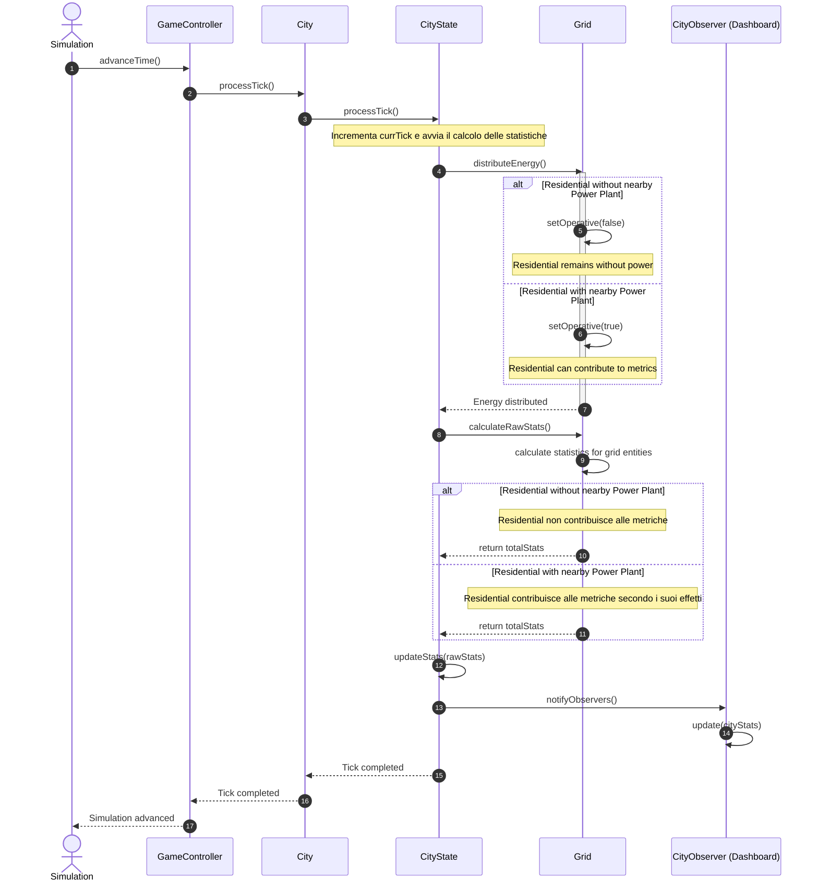

```mermaid
sequenceDiagram
    autonumber
    actor System as Simulation
    participant Controller as GameController
    participant CityObj as City
    participant State as CityState
    participant TheGrid as Grid
    participant Observer as CityObserver (Dashboard)

    System->>Controller: advanceTime()
    Controller->>CityObj: processTick()
    CityObj->>State: processTick()

    Note over State: Incrementa currTick e avvia il calcolo delle statistiche

    State->>TheGrid: distributeEnergy()
    activate TheGrid

    alt Residential without nearby Power Plant
        TheGrid->>TheGrid: setOperative(false)
        Note over TheGrid: Residential remains without power
    else Residential with nearby Power Plant
        TheGrid->>TheGrid: setOperative(true)
        Note over TheGrid: Residential can contribute to metrics
    end

    TheGrid-->>State: Energy distributed
    deactivate TheGrid

    State->>TheGrid: calculateRawStats()

    TheGrid->>TheGrid: calculate statistics for grid entities

    alt Residential without nearby Power Plant
        Note over TheGrid: Residential non contribuisce alle metriche
        TheGrid-->>State: return totalStats
    else Residential with nearby Power Plant
        Note over TheGrid: Residential contribuisce alle metriche secondo i suoi effetti
        TheGrid-->>State: return totalStats
    end

    State->>State: updateStats(rawStats)
    State->>Observer: notifyObservers()
    Observer->>Observer: update(cityStats)

    State-->>CityObj: Tick completed
    CityObj-->>Controller: Tick completed
    Controller-->>System: Simulation advanced
```
