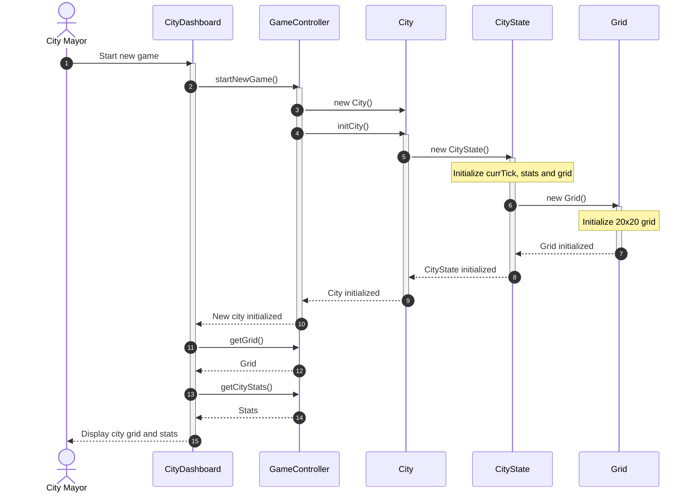

```mermaid
sequenceDiagram
    autonumber
    actor Mayor as City Mayor
    participant Dashboard as CityDashboard
    participant Controller as GameController
    participant City as City
    participant State as CityState
    participant Grid as Grid

    Mayor->>Dashboard: Start new game
    activate Dashboard

    Dashboard->>Controller: startNewGame()
    activate Controller

    Controller->>City: new City()
    Controller->>City: initCity()
    activate City

    City->>State: new CityState()
    activate State

    Note over State: Initialize currTick, stats and grid

    State->>Grid: new Grid()
    activate Grid

    Note over Grid: Initialize 20x20 grid

    Grid-->>State: Grid initialized
    deactivate Grid

    State-->>City: CityState initialized
    deactivate State

    City-->>Controller: City initialized
    deactivate City

    Controller-->>Dashboard: New city initialized
    deactivate Controller

    Dashboard->>Controller: getGrid()
    Controller-->>Dashboard: Grid

    Dashboard->>Controller: getCityStats()
    Controller-->>Dashboard: Stats

    Dashboard-->>Mayor: Display city grid and stats
    deactivate Dashboard
```
