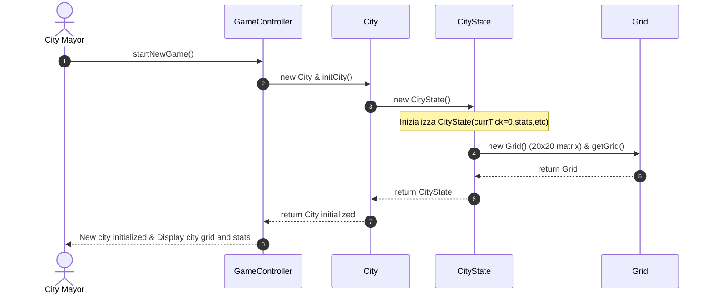

```mermaid
sequenceDiagram
    autonumber
    actor Mayor as City Mayor
    participant Controller as GameController
    participant CityObj as City
    participant State as CityState
    participant TheGrid as Grid

    
    Mayor->>Controller: startNewGame()
    Controller->>CityObj:  new City & initCity()
    CityObj->>State: new CityState()
    Note over State:Inizializza CityState(currTick=0,stats,etc)
    State->>TheGrid: new Grid() (20x20 matrix) & getGrid()
    TheGrid-->>State: return Grid
    State-->>CityObj: return CityState
    CityObj-->>Controller: return City initialized
    Controller-->>Mayor: New city initialized & Display city grid and stats
```
