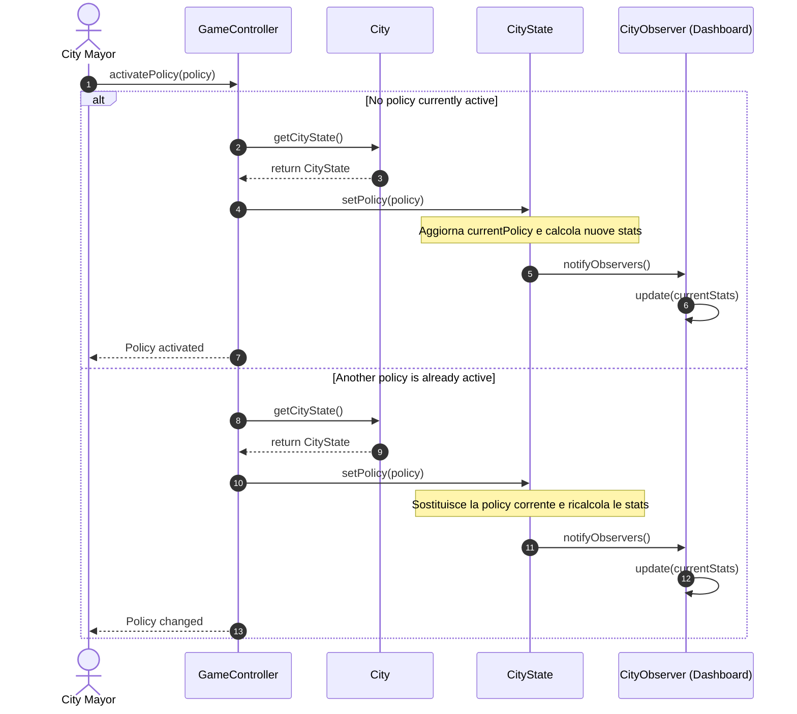

```mermaid
sequenceDiagram
    autonumber
    actor Mayor as City Mayor
    participant Controller as GameController
    participant CityObj as City
    participant State as CityState
    participant Observer as CityObserver (Dashboard)

    Mayor->>Controller: activatePolicy(policy)
    
    alt No policy currently active
        Controller->>CityObj: getCityState()
        CityObj-->>Controller: return CityState
        Controller->>State: setPolicy(policy)
        Note over State: Aggiorna currentPolicy e calcola nuove stats
        State->>Observer: notifyObservers()
        Observer->>Observer: update(currentStats)
        Controller-->>Mayor: Policy activated
    else Another policy is already active
        Controller->>CityObj: getCityState()
        CityObj-->>Controller: return CityState
        Controller->>State: setPolicy(policy)
        Note over State: Sostituisce la policy corrente e ricalcola le stats
        State->>Observer: notifyObservers()
        Observer->>Observer: update(currentStats)
        Controller-->>Mayor: Policy changed
    end
```
