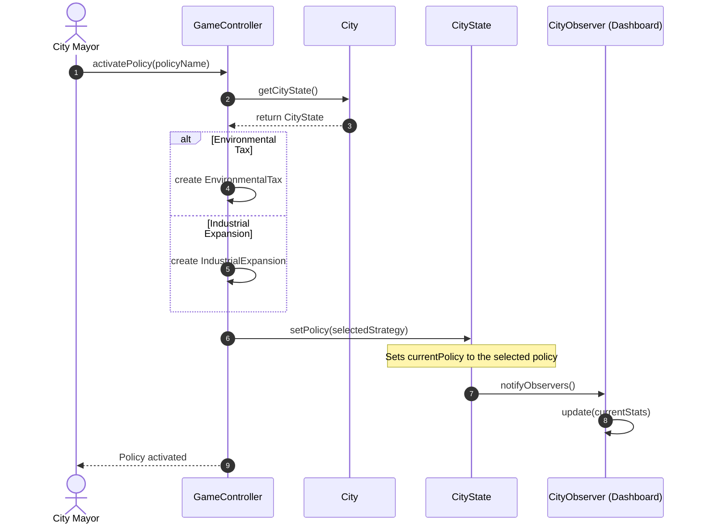

```mermaid
sequenceDiagram
    autonumber
    actor Mayor as City Mayor
    participant Controller as GameController
    participant CityObj as City
    participant State as CityState
    participant Observer as CityObserver (Dashboard)

    Mayor->>Controller: activatePolicy(policyName)

    Controller->>CityObj: getCityState()
    CityObj-->>Controller: return CityState

    alt Environmental Tax
        Controller->>Controller: create EnvironmentalTax
    else Industrial Expansion
        Controller->>Controller: create IndustrialExpansion
    end
    
    Controller->>State: setPolicy(selectedStrategy)
    Note over State: Sets currentPolicy to the selected policy

    State->>Observer: notifyObservers()
    Observer->>Observer: update(currentStats)

    Controller-->>Mayor: Policy activated
```
