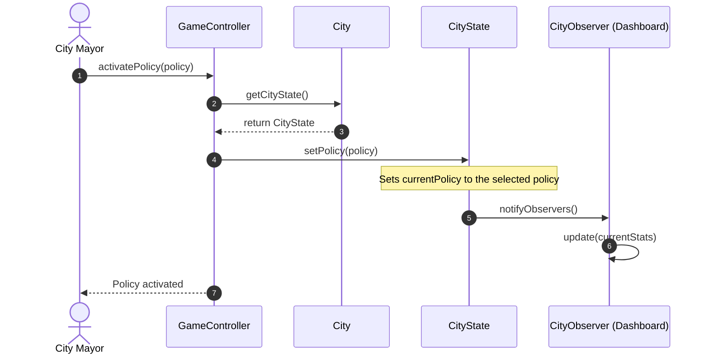

```mermaid
sequenceDiagram
    autonumber
    actor Mayor as City Mayor
    participant Controller as GameController
    participant CityObj as City
    participant State as CityState
    participant Observer as CityObserver (Dashboard)

    Mayor->>Controller: activatePolicy(policy)

    Controller->>CityObj: getCityState()
    CityObj-->>Controller: return CityState

    Controller->>State: setPolicy(policy)
    Note over State: Sets currentPolicy to the selected policy

    State->>Observer: notifyObservers()
    Observer->>Observer: update(currentStats)

    Controller-->>Mayor: Policy activated
```
