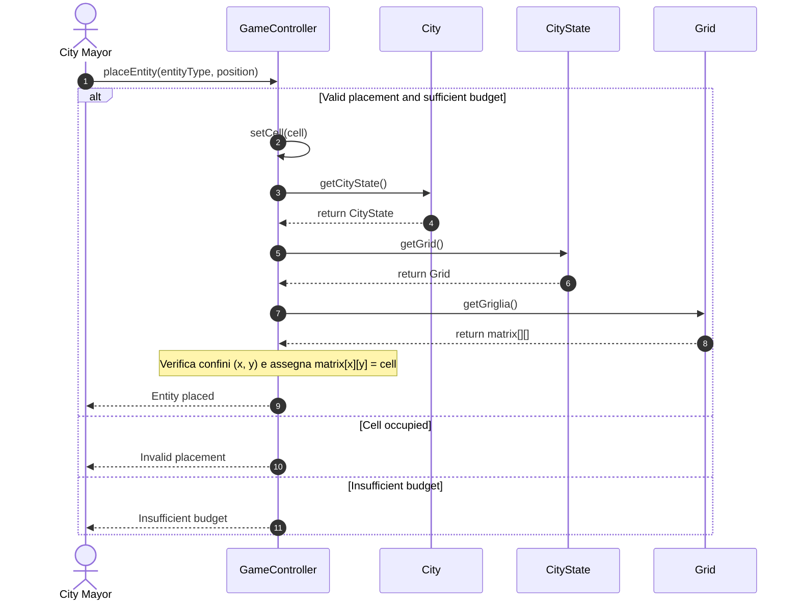

```mermaid
sequenceDiagram
    autonumber
    actor Mayor as City Mayor
    participant Controller as GameController
    participant CityObj as City
    participant State as CityState
    participant TheGrid as Grid

    Mayor->>Controller: placeEntity(entityType, position)
    
    alt Valid placement and sufficient budget
        Controller->>Controller: setCell(cell)
        Controller->>CityObj: getCityState()
        CityObj-->>Controller: return CityState
        Controller->>State: getGrid()
        State-->>Controller: return Grid
        Controller->>TheGrid: getGriglia()
        TheGrid-->>Controller: return matrix[][]
        Note over Controller: Verifica confini (x, y) e assegna matrix[x][y] = cell
        Controller-->>Mayor: Entity placed
    else Cell occupied
        Controller-->>Mayor: Invalid placement
    else Insufficient budget
        Controller-->>Mayor: Insufficient budget
    end
```
