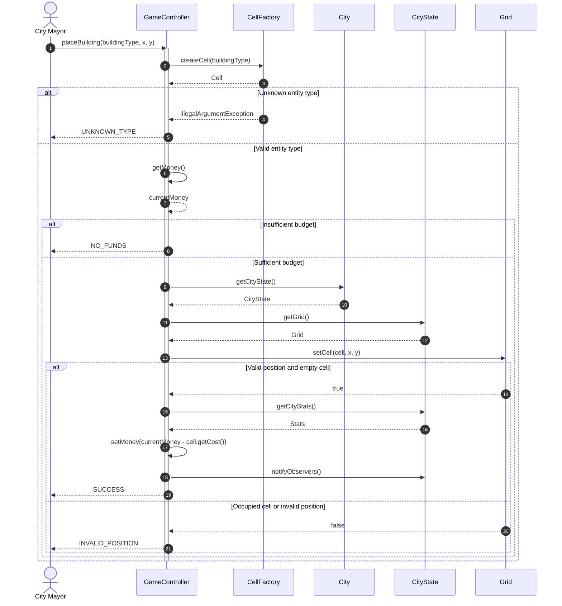

```mermaid
sequenceDiagram
    autonumber
    actor Mayor as City Mayor
    participant Controller as GameController
    participant Factory as CellFactory
    participant CityObj as City
    participant State as CityState
    participant Grid as Grid

    Mayor->>Controller: placeBuilding(buildingType, x, y)
    activate Controller

    Controller->>Factory: createCell(buildingType)
    Factory-->>Controller: Cell

    alt Unknown entity type
        Factory-->>Controller: IllegalArgumentException
        Controller-->>Mayor: UNKNOWN_TYPE
    else Valid entity type

        Controller->>Controller: getMoney()
        Controller-->>Controller: currentMoney

        alt Insufficient budget
            Controller-->>Mayor: NO_FUNDS
        else Sufficient budget

            Controller->>CityObj: getCityState()
            CityObj-->>Controller: CityState

            Controller->>State: getGrid()
            State-->>Controller: Grid

            Controller->>Grid: setCell(cell, x, y)

            alt Valid position and empty cell
                Grid-->>Controller: true
                Controller->>State: getCityStats()
                State-->>Controller: Stats
                Controller->>Controller: setMoney(currentMoney - cell.getCost())
                Controller->>State: notifyObservers()
                Controller-->>Mayor: SUCCESS
            else Occupied cell or invalid position
                Grid-->>Controller: false
                Controller-->>Mayor: INVALID_POSITION
            end
        end
    end

    deactivate Controller
```
