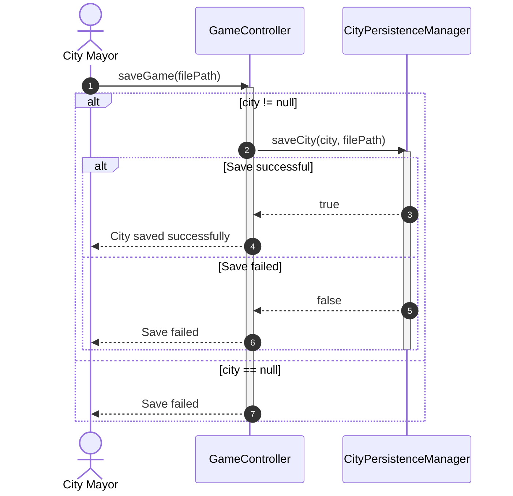

```mermaid
sequenceDiagram
    autonumber
    actor Mayor as City Mayor
    participant Controller as GameController
    participant Persistence as CityPersistenceManager

    Mayor->>Controller: saveGame(filePath)
    activate Controller

    alt city != null
        Controller->>Persistence: saveCity(city, filePath)
        activate Persistence

        alt Save successful
            Persistence-->>Controller: true
            Controller-->>Mayor: City saved successfully
        else Save failed
            Persistence-->>Controller: false
            Controller-->>Mayor: Save failed
        end

        deactivate Persistence
    else city == null
        Controller-->>Mayor: Save failed
    end

    deactivate Controller
```
