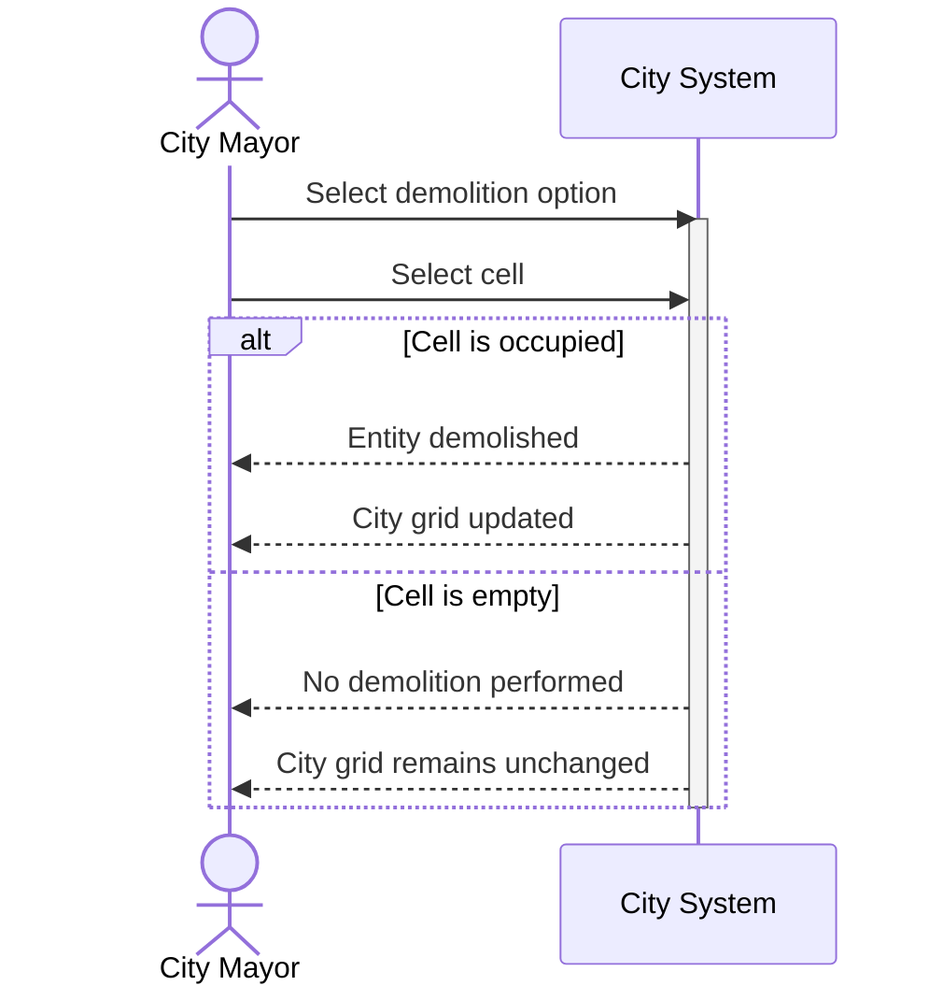

```mermaid
sequenceDiagram
    actor Mayor as City Mayor
    participant System as City System

    Mayor->>System: Select demolition option
    activate System
    Mayor->>System: Select cell

    alt Cell is occupied
        System-->>Mayor: Entity demolished
        System-->>Mayor: City grid updated
    else Cell is empty
        System-->>Mayor: No demolition performed
        System-->>Mayor: City grid remains unchanged
    end

    deactivate System
```
