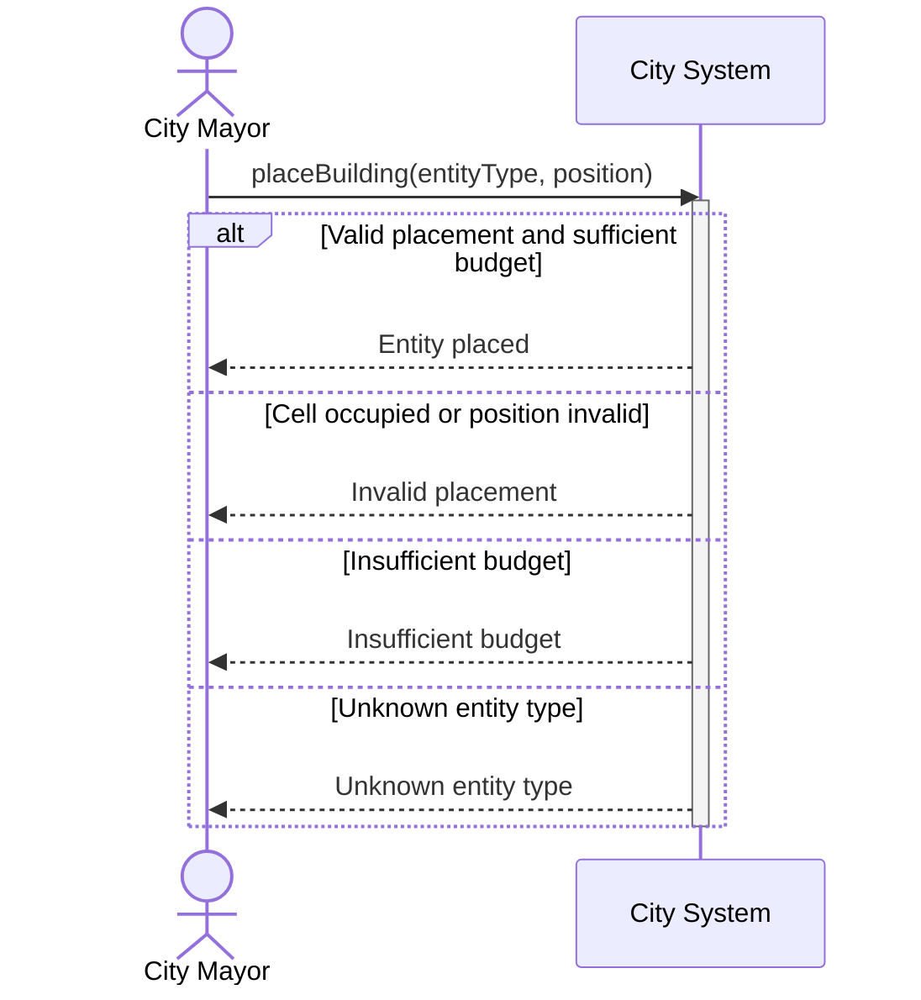

```mermaid
sequenceDiagram
    actor Mayor as City Mayor
    participant System as City System

    Mayor->>System: placeBuilding(entityType, position)
    activate System

    alt Valid placement and sufficient budget
        System-->>Mayor: Entity placed
    else Cell occupied or position invalid
        System-->>Mayor: Invalid placement
    else Insufficient budget
        System-->>Mayor: Insufficient budget
    else Unknown entity type
        System-->>Mayor: Unknown entity type
    end

    deactivate System
```
