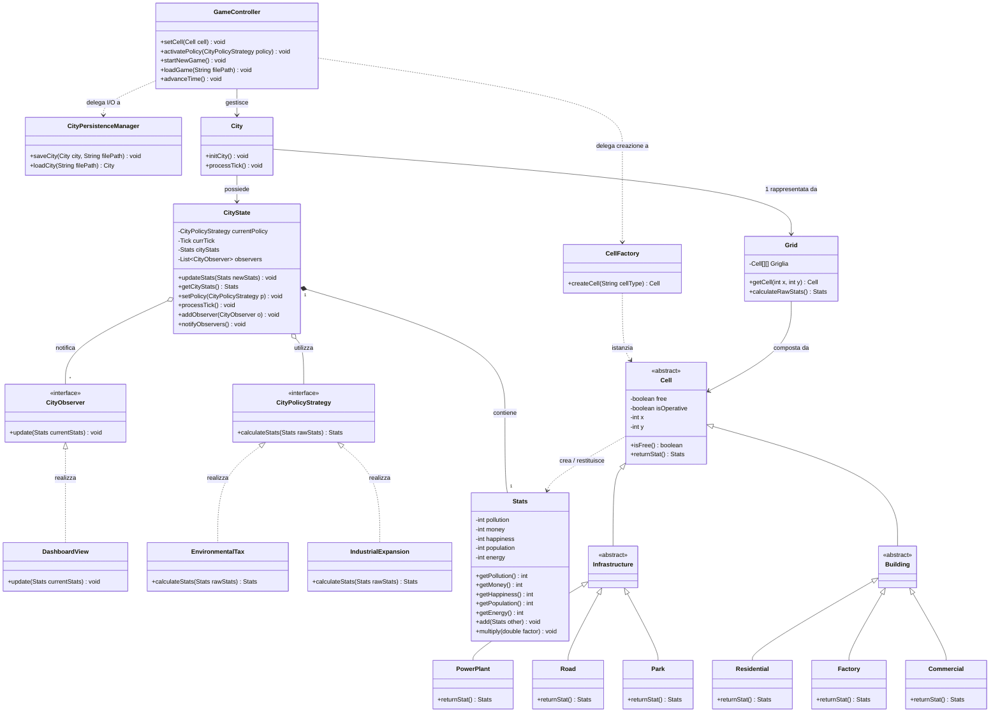

L'architettura del sistema è stata progettata per mantenere i componenti separati, facili da testare e pronti per future espansioni, applicando i principi GRASP (Alta Coesione, Basso Accoppiamento) e i design pattern della Gang of Four (GoF).

Core Engine e Modello di Dominio

City & CityState: City è la classe base che avvia il simulatore. Per evitare che diventi troppo complessa ("God Object"), delega tutta la memoria del gioco (turno corrente, statistiche, politiche attive) alla classe CityState.

Grid & Cell: La mappa spaziale è gestita da Grid. Invece di avere matrici separate per ogni tipo di edificio, la griglia usa la classe astratta Cell. Questo permette alla mappa di iterare su tutti gli edifici in modo polimorfico, chiamando il metodo generico returnStat() senza dover sapere esattamente quale edificio sta elaborando.

Stats: Funziona come un Data Transfer Object (DTO). Incapsula tutte le variabili (soldi, inquinamento, energia) rendendole private, ed espone metodi getter sicuri e metodi matematici interni (add, multiply) per impedire che altre classi alterino i dati in modo imprevisto.

Design Pattern Implementati

Model-View-Controller (GameController): Il sistema isola la logica di business dall'interfaccia grafica. Il GameController gestisce gli input dell'utente (es. piazzare un edificio, attivare una politica) e li traduce in comandi per il motore di gioco, proteggendo lo stato interno di City.

Factory Pattern (CellFactory): Il compito di istanziare gli edifici fisici è delegato a una fabbrica dedicata. Quando il Controller deve piazzare un edificio, non chiama il costruttore concreto (es. new Park()), ma chiede alla CellFactory di restituirgli una generica Cell. Questo rende il codice flessibile: aggiungere nuovi edifici in futuro richiederà modifiche solo alla Factory.

Observer Pattern (CityObserver & DashboardView): Garantisce il flusso dei dati verso lo schermo senza bloccare il motore. A ogni fine turno, CityState (il Soggetto) notifica gli osservatori registrati (es. DashboardView) inviando l'oggetto Stats aggiornato. In questo modo il motore non dipende dalla specifica tecnologia grafica usata (Swing, Web, ecc.).

Strategy Pattern (CityPolicyStrategy): Le normative cittadine (es. Tasse, Espansione Industriale) alterano il calcolo dei punteggi. Invece di riempire il motore con blocchi if/else, ogni politica è una classe separata che implementa la stessa interfaccia. Le regole possono così essere scambiate a runtime in modo trasparente.

Pure Fabrication (CityPersistenceManager): Per mantenere l'Alta Coesione e rispettare il principio di Singola Responsabilità (SRP), la logica di I/O (lettura e scrittura dei file JSON per i salvataggi) è stata completamente rimossa da City e isolata in un gestore dedicato.
