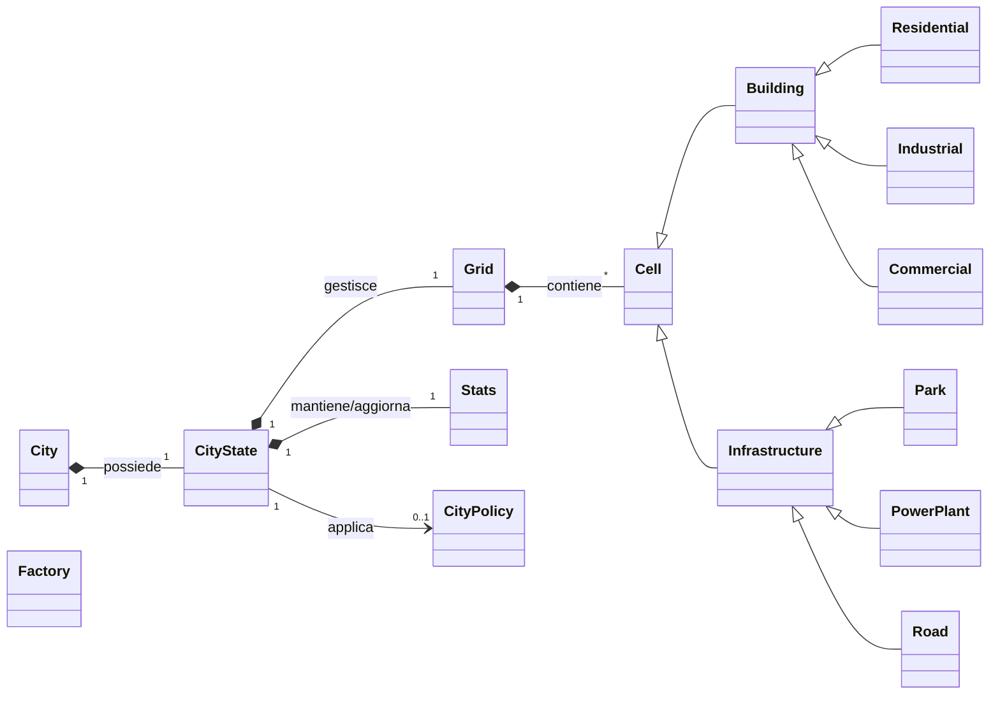

```mermaid
classDiagram
    direction LR

    %% =========================
    %% MAIN DOMAIN ENTITIES
    %% =========================

    class City

    class CityState

    class Grid

    class Cell

    class Building

    class Infrastructure

    class Residential

    class Factory

    class Commercial

    class Park

    class PowerPlant

    class Road

    class Stats

    class CityPolicy


    %% =========================
    %% RELATIONSHIPS
    %% =========================

    City "1" *-- "1" CityState : possiede

    CityState "1" *-- "1" Grid : gestisce

    CityState "1" *-- "1" Stats : mantiene/aggiorna

    CityState "1" --> "0..1" CityPolicy : applica

    Grid "1" *-- "*" Cell : contiene

    Cell <|-- Building
    Cell <|-- Infrastructure

    Building <|-- Residential
    Building <|-- Industrial
    Building <|-- Commercial

    Infrastructure <|-- Park
    Infrastructure <|-- PowerPlant
    Infrastructure <|-- Road
```
