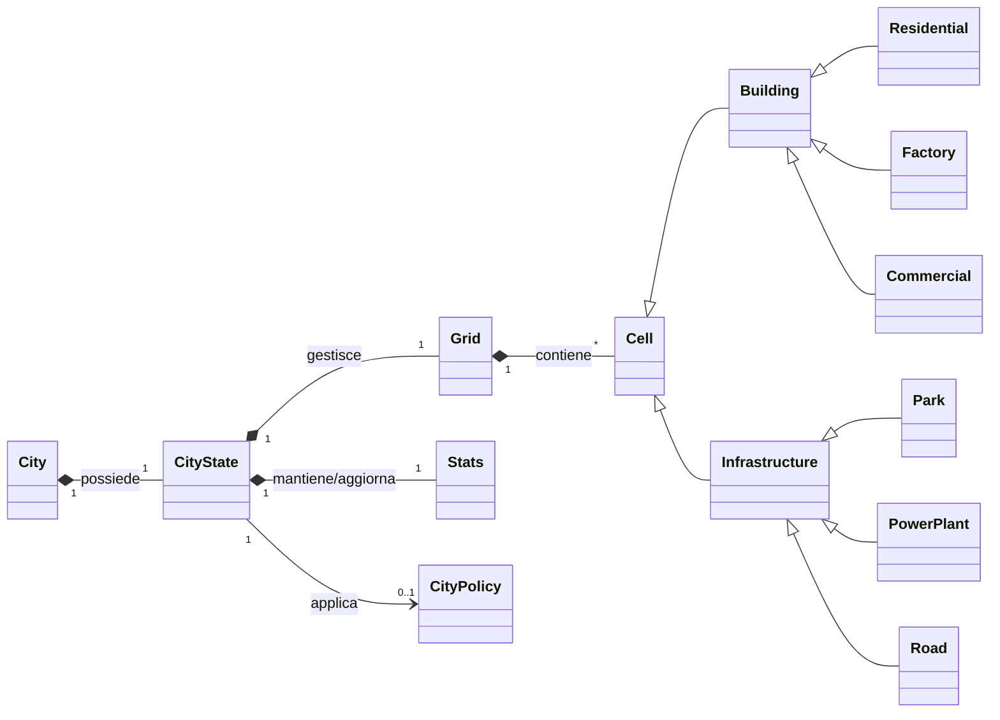

## Entità Concettuali Principali

### City (Città)

L'entità principale che rappresenta la città oggetto della simulazione. È associata allo stato corrente della città, che ne descrive l'evoluzione nel tempo e la situazione attuale.

### CityState (Stato della Città)

Rappresenta lo stato dinamico della città durante la simulazione. Mantiene le informazioni relative all'evoluzione temporale, alla configurazione della città, alle metriche globali e all'eventuale politica attiva.

### Grid (Griglia / Mappa Urbana)

Rappresenta la struttura spaziale della città attraverso una griglia bidimensionale. Contiene le celle che costituiscono il territorio urbano e ne determina la disposizione spaziale.

### Cell (Cella / Entità Territoriale)

Rappresenta un'unità della griglia urbana. Una cella può contenere un edificio o un'infrastruttura, come **Residential, Factory, Commercial, Park, Power Plant o Road**, e contribuisce allo stato complessivo della città.

### Building (Edificio)

Rappresenta la categoria concettuale degli edifici presenti nella città. Comprende edifici **Residential, Factory e Commercial**, ciascuno caratterizzato da specifici effetti sulle metriche della città.

### Infrastructure (Infrastruttura)

Rappresenta la categoria concettuale delle infrastrutture presenti nella città. Comprende **Park, Power Plant e Road**, che contribuiscono in modo diverso allo stato e alle metriche della città.

### Stats (Statistiche / Metriche Globali)

Rappresenta l'insieme delle metriche che descrivono lo stato della città, tra cui **Money, Population, Happiness, Pollution ed Energy**. I loro valori dipendono dagli elementi presenti nella città e dalle regole o politiche applicate alla simulazione.

### CityPolicy (Politica Cittadina)

Rappresenta una politica che può essere attivata dal City Mayor per modificare il modo in cui determinate metriche della città vengono calcolate. Tra le politiche disponibili sono presenti, ad esempio, **Environmental Tax** e **Industrial Expansion**.

## Relazioni Chiave del Dominio

### City (1) ---- possiede ----> (1) CityState

Ogni città possiede un unico stato corrente che rappresenta la situazione della città durante la simulazione.

### CityState (1) ---- gestisce ----> (1) Grid

Lo stato della città è associato a una griglia che rappresenta la disposizione spaziale degli edifici e delle infrastrutture.

### Grid (1) ---- contiene ----> (*) Cell

La griglia è composta da celle che rappresentano le posizioni disponibili nel territorio urbano. Essendo la griglia 20×20, può contenere fino a 400 celle.

### Cell ---- Building

Gli edifici sono una specializzazione delle celle e comprendono **Residential, Factory e Commercial**.

### Cell ---- Infrastructure

Le infrastrutture sono una specializzazione delle celle e comprendono **Park, Power Plant e Road**.

### CityState (1) ---- mantiene/aggiorna ----> (1) Stats

Lo stato della città mantiene le metriche globali che descrivono la situazione corrente della città.

### CityState (1) ---- applica ----> (0..1) CityPolicy

Una città può avere zero oppure una politica attiva. Quando presente, la politica influenza il calcolo delle metriche secondo le proprie regole.
