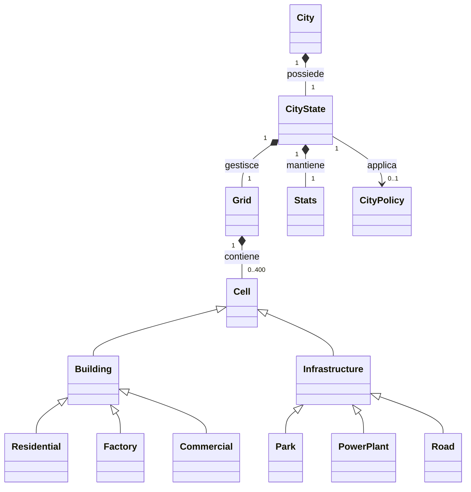

```mermaid
classDiagram

    %% =========================
    %% DOMAIN MODEL
    %% =========================

    class City

    class CityState

    class Grid

    class Cell

    class Building

    class Infrastructure

    class Residential

    class Factory

    class Commercial

    class Park

    class PowerPlant

    class Road

    class Stats

    class CityPolicy


    %% =========================
    %% RELATIONSHIPS
    %% =========================

    City "1" *-- "1" CityState : possiede

    CityState "1" *-- "1" Grid : gestisce

    Grid "1" *-- "0..400" Cell : contiene

    Cell <|-- Building

    Cell <|-- Infrastructure

    Building <|-- Residential

    Building <|-- Factory

    Building <|-- Commercial

    Infrastructure <|-- Park

    Infrastructure <|-- PowerPlant

    Infrastructure <|-- Road

    CityState "1" *-- "1" Stats : mantiene

    CityState "1" --> "0..1" CityPolicy : applica
```
